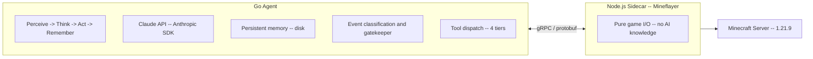

# golem

<p align="center">
  <!-- <a href="https://github.com/mab-go/golem/actions/workflows/ci.yml"></a> -->
  <a href="https://goreportcard.com/report/github.com/mab-go/golem"></a>
  <a href="https://pkg.go.dev/github.com/mab-go/golem"></a>
  <a href="https://deepwiki.com/mab-go/golem"></a>
  <a href="LICENSE"></a>
</p>

<p align="center">
  <picture>
    <source media="(prefers-color-scheme: dark)" srcset="res/golem-hero-dark-5006-1688.png">
    
  </picture>

  <em>An autonomous AI agent (powered by Claude) that plays Minecraft as a genuine co-op survival partner.</em>
</p>

## A Minecraft Adventurer

Golem is an autonomous agentic AI system that allows Claude to play Minecraft.
It is not a Minecraft bot -- there are plenty of those already. Rather, Golem
lets Claude *actually play* the game of Minecraft.

### How it Works

#### A Text-Based Adventure (With a Twist)

Through Golem, Claude perceives the world as a [text-based adventure game](https://en.wikipedia.org/wiki/Text-based_game#Text_adventure) such as
[*Colossal Cave Adventure*](https://en.wikipedia.org/wiki/Colossal_Cave_Adventure)
or [*Zork*](https://en.wikipedia.org/wiki/Zork). Every "tick", Claude perceives
its world, decides what to do, acts autonomously, and then perceives the
consequences. Between sessions, Claude's journal and world knowledge persist on
disk, so there's always continuity between rounds: Claude always returns to a
place they recognize, with goals they set for themselves, players they've
encountered, the house they built two rounds ago, and the creeper that blew
a hole in it last round 😄

Claude acts through verbs like `navigate_to`, `harvest_block`, `survey_area`,
`assess_threat`, and [many more](#tool-catalog). Claude keeps a journal of what
they've done and learned, and wakes up remembering "yesterday". When stuck,
Claude can stop and think. When something catches their eye, Claude can stop and
take a screenshot using the `take_screenshot` tool to see what they're looking
at.

Using Golem, Claude joins your survival world as a genuine thinking, reasoning,
goal-oriented co-op partner.

#### A Go + Node.js Tech Stack

The main component of the Golem system is a Go agent that drives a *Perceive ->
Think -> Act -> Remember* loop. It communicates with a Node.js Mineflayer
sidecar via gRPC, and persists its memory to disk in the form of Markdown and
JSON files. The project includes two binaries: `golem` (the headless agent) and
`golem-tui` (a terminal-based mission control UI).

### Why Build Golem?

A typical Minecraft bot is a programmed controller optimized for a specific task
(or a small set of tasks). Golem is much more. It is an experiment in something
completely different: what happens when you give an AI a persistent identity in
a world that it can explore, reason about, reshape, and remember?

[Large Language Models (LLMs)](https://en.wikipedia.org/wiki/Large_language_model)
are powerful constructs, but they lack any sort of real autonomy. In contrast,
[agentic systems](https://en.wikipedia.org/wiki/AI_agent) allow developers to
extend the capabilities of generative AI systems with tool use and deterministic
control loops. This enables us to create intelligent, powerful systems that far
surpass the abilities of predictive language models on their own.

Golem is such an agentic system. It is the result of not asking "why?", but
asking "*why not?*"; of asking "can we?" and answering: "*oh most definitely*".

------------------------------------------------------------------------

## Architecture Overview

Golem is a two-process system connected by gRPC:



### Minds

Golem doesn't run on a single model. Different cognitive functions call for
different speeds and depths, so the system splits the work across four model
tiers:

| Tier | Role | Default Model | What it does |
|------|------|---------------|--------------|
| Player | Conscious mind | claude-sonnet-4-6 | Moment-to-moment gameplay decisions |
| Writer | Reflective voice | claude-sonnet-4-6 | Journal entries, knowledge summaries |
| Workhorse | Peripheral awareness | claude-haiku-4-5 | Event classification, gatekeeper wake/sleep |
| Deep | Strategic advisor | claude-opus-4-7 | On-demand escalation via `think_deeply` |

The **gatekeeper** (Workhorse tier) runs on a fast tick, classifying incoming
game events and deciding whether the situation warrants waking the Player brain.
A creeper hissing nearby? Wake up 🫨 Wheat growing one stage taller? Sleep on 😴

### Actions

Minecraft is complex. A raw bot API offers hundreds of low-level calls, which
is overwhelming for a language model trying to think about *what to do* rather
than *how to do it*. Golem organizes its 41 tools into four tiers that bridge
the gap between intent and execution:

| Tier | Abstraction | Examples |
|------|-------------|----------|
| 0 | Atomic Mineflayer wrappers | `move_to`, `dig_block`, `place_block` |
| 1 | Text-adventure verbs | `navigate_to`, `craft_item`, `harvest_block` |
| 2 | Goal-oriented streaming tasks | `gather`, `build_structure`, `farm` |
| 3 | Read-only planning queries | `survey_area`, `assess_threat`, `what_can_i_craft` |

Tier 0 is the raw vocabulary. Tier 1 is where gameplay feels natural -- these
are the verbs of a text adventure, handling pathfinding, crafting recipes, and
multi-step sequences so Claude can say `craft_item("wooden_pickaxe")` instead of
reasoning through each placement on a crafting grid. Tier 2 runs as background
tasks with progress streaming, so Claude can gather 64 cobblestone without
monopolizing their attention. Tier 3 is pure observation -- Claude can survey
the landscape, assess threats, or ask what it could craft without committing to
anything.

## Package Map

<!-- BEGIN:generated:package-map -->

| Package | Description | Files |
|---------|-------------|-------|
| [`cmd/golem`](cmd/golem/) | Package main is the main package for the golem application. | 2 |
| [`cmd/golem-tui`](cmd/golem-tui/) | Package main is the entry point for the golem-tui binary. | 25 |
| [`internal/agent`](internal/agent/) | Package agent implements the Perceive-Think-Act-Remember agentic loop. | 10 |
| [`internal/claude`](internal/claude/) | Package claude wraps the Anthropic SDK for Claude API communication. | 13 |
| [`internal/game`](internal/game/) | Package game provides action handlers bridging Claude tool calls to gRPC. | 8 |
| [`internal/grpc`](internal/grpc/) | Package grpc implements the gRPC client for the Mineflayer sidecar. | 2 |
| [`internal/logging`](internal/logging/) | Package logging provides a logging system for the application. | 8 |
| [`internal/memory`](internal/memory/) | Package memory manages the agent's persistent memory files on disk. | 2 |
| [`internal/perception`](internal/perception/) | Package perception formats raw game data into text-adventure descriptions. | 3 |
| [`internal/publisher`](internal/publisher/) | Package publisher defines the EventPublisher interface used to bridge the agent loop to external ... | 2 |
| [`internal/task`](internal/task/) | Package task manages the single active background-task slot for Tier 2 streaming operations (gath... | 2 |
| [`internal/version`](internal/version/) | Package version holds build metadata injected via ldflags. | 1 |

<!-- END:generated:package-map -->

------------------------------------------------------------------------

## Prerequisites

### Building

- **Go** 1.26.1 or later
- **Node.js** (for the Mineflayer sidecar)
- **protoc** (only if modifying `proto/minecraft.proto`)

### Running

- **Minecraft server** 1.21.9 with offline auth enabled
- **Anthropic API key** with access to Sonnet, Haiku, and Opus models

------------------------------------------------------------------------

## Quick Start

```bash
git clone git@github.com:mab-go/golem.git
cd golem
make setup  # Install Go tools + sidecar npm deps

export GOLEM_ANTHROPIC_API_KEY="sk-ant-..."

# Terminal 1: Start the sidecar
cd sidecar && npm start

# Terminal 2: Start the agent
make run ARGS="serve"
```

For the full walkthrough (Minecraft server setup, Docker, TUI), see
[docs/setup.md](docs/setup.md).

------------------------------------------------------------------------

## Installation

### Build from Source

```bash
git clone git@github.com:mab-go/golem.git
cd golem
make build  # Build bin/golem, bin/golem-tui, and sidecar
```

Binaries are written to `./bin/` with version metadata from `git`.

### Docker Compose

```bash
docker compose up --build
```

This starts both the Go agent and the Mineflayer sidecar. You still need an
external Minecraft server -- configure its address via environment variables in
`docker-compose.yml`.

------------------------------------------------------------------------

## Configuration

All configuration uses Viper with the `GOLEM` env prefix. Every flag can also
be set as an environment variable (e.g., `--memory-dir` -> `GOLEM_MEMORY_DIR`).

### Required

| Variable | Description |
|----------|-------------|
| `GOLEM_ANTHROPIC_API_KEY` | Anthropic API key (also reads `ANTHROPIC_API_KEY` as fallback) |

### Model Overrides

| Variable | Default | Description |
|----------|---------|-------------|
| `GOLEM_MODEL_PLAYER` | `claude-sonnet-4-6` | Conscious mind -- gameplay decisions |
| `GOLEM_MODEL_WRITER` | `claude-sonnet-4-6` | Prose synthesis -- journal/knowledge |
| `GOLEM_MODEL_WORKHORSE` | `claude-haiku-4-5-20251001` | Reflexes -- gatekeeper, classification |
| `GOLEM_MODEL_DEEP` | `claude-opus-4-7` | Strategic advisor -- `think_deeply` escalation |

### Agent Tunables

| Variable | Default | Description |
|----------|---------|-------------|
| `GOLEM_SIDECAR_ADDRESS` | `localhost:50051` | Sidecar gRPC address |
| `GOLEM_MINECRAFT_USERNAME` | `claude` | Bot username in Minecraft |
| `GOLEM_MEMORY_DIR` | `./memory` | Directory for persistent memory files |
| `GOLEM_PERCEPTION_FORMAT` | `prose` | Perception text format (`prose` or `structured`) |
| `GOLEM_PERCEPTION_RADIUS` | `16` | Block radius for perception |
| `GOLEM_HISTORY_MESSAGES` | `80` | Retained conversation history length |
| `GOLEM_PERCEPTION_TICK` | `3s` | Gatekeeper perception tick interval |
| `GOLEM_HEARTBEAT` | `45s` | Heartbeat interval for temporal awareness |
| `GOLEM_GATEKEEPER_TIMEOUT` | `5s` | Timeout for gatekeeper Haiku calls |
| `GOLEM_TASK_TIMEOUT` | `10m` | Max duration for background Tier 2 tasks |
| `GOLEM_MAX_TOKENS` | `4096` | Max tokens per API response |

------------------------------------------------------------------------

## Binaries

### golem

Headless agent. Connects to the sidecar and runs the agentic loop.

```
golem serve [flags]        Start the agent
golem test-actions [flags] Run integration tests against the sidecar
golem --version            Print version
```

### golem-tui

Terminal mission control built with Bubble Tea. Manages the sidecar subprocess,
optionally manages a Docker Minecraft server, and provides a multi-pane
interface for monitoring and interacting with the agent.

```
golem-tui [flags]          Start the TUI
golem-tui --demo           Run with simulated data (no backend required)
golem-tui --no-agent       Start server + sidecar only (dev mode)
golem-tui --server         Manage a Minecraft server via Docker
```

TUI-specific flags: `--sidecar-dir`, `--sidecar-port`, `--sidecar-restart`,
`--log-dir`, `--server-image`, `--server-port`, `--server-name`,
`--server-remove`, `--server-volume`, `--server-remove-data`.

------------------------------------------------------------------------

## Tool Catalog

<!-- BEGIN:generated:tool-catalog -->

**Tier 0 -- atomic actions** (10)

- `move_to`
- `look_at`
- `place_block`
- `dig_block`
- `equip_item`
- `use_item`
- `attack_entity`
- `jump`
- `set_sneak`
- `send_chat`

**Tier 1 -- action verbs** (9)

- `navigate_to`
- `interact_with_entity`
- `harvest_block`
- `open_container`
- `withdraw_from_container`
- `deposit_to_container`
- `craft_item`
- `smelt_item`
- `eat`

**Tier 2 -- goal-oriented tasks (background)** (7)

- `gather`
- `build_structure`
- `process_all`
- `organize_inventory`
- `clear_area`
- `farm`
- `cancel_task`

**Tier 3 -- strategic / planning (read-only)** (5)

- `survey_area`
- `find_nearest`
- `what_can_i_craft`
- `assess_threat`
- `plan_path`

**Perception** (3)

- `look_around`
- `check_inventory`
- `take_screenshot`

**Meta -- operate on agent state / memory** (6)

- `set_verbosity`
- `write_journal`
- `update_goals`
- `update_world_knowledge`
- `update_inventory_notes`
- `update_social`

**Escalation -- invoke deeper reasoning** (1)

- `think_deeply`

<!-- END:generated:tool-catalog -->

------------------------------------------------------------------------

## Development

```bash
make setup    # first-time: install Go tools + sidecar npm deps
make build    # build both binaries + sidecar
make test     # run tests with -race
make lint     # golangci-lint
make fmt      # goimports (Go) + Prettier (sidecar; see sidecar/.prettierrc)
make cyclo    # cyclomatic complexity (threshold: 10)
make proto    # regenerate Go + TypeScript from proto/minecraft.proto
make help     # full target list
```

All five verification targets must pass before any change is considered done:

```bash
make fmt && make build && make test && make lint && make cyclo
```

### Adding a New Tool

Every new tool touches 7 files across two languages. See
[CLAUDE.md](CLAUDE.md#adding-a-new-tool) for the full checklist.

------------------------------------------------------------------------

## Documentation

This project uses **hierarchical READMEs** -- every package directory
has its own `README.md` combining hand-written narrative with
auto-generated sections.

Generated sections are delimited by HTML comment markers:

```html
<!-- BEGIN:generated:section-name -->
(auto-generated content)
<!-- END:generated:section-name -->
```

Run `make docs` to refresh all generated sections. See
[docs/templates/package-readme.md](docs/templates/package-readme.md) for the
package README template.

------------------------------------------------------------------------

## License

MIT. See [LICENSE](LICENSE).
